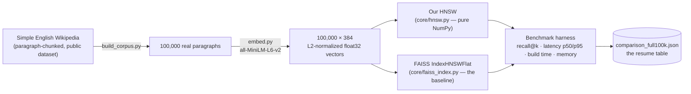

# RecallBench


A from-scratch implementation of HNSW — the graph algorithm underlying
production vector databases such as Pinecone and Weaviate — benchmarked
rigorously against FAISS, the industry-standard library, and integrated
into a working RAG pipeline that retrieves from a real 100,000-paragraph
Wikipedia corpus.

### Contents
[Why I built this](#why-i-built-this) · [How this was built](#how-this-was-built) · [Demo](#demo) · [Architecture](#architecture) · [How HNSW actually works](#how-hnsw-actually-works) · [The benchmark](#the-benchmark) · [Engineering log](#engineering-log) · [Limitations](#limitations--whats-next) · [Tech stack](#tech-stack) · [Running locally](#running-locally) · [API](#api)

---

## Why I built this

Assembling a RAG pipeline from existing libraries demonstrates
integration skill, not algorithmic understanding. It says nothing about
whether the person doing the assembling understands what those libraries
are actually doing beneath the API surface they called.

Vector search is the component that matters most in a RAG system: given
a query, retrieve the small set of documents — out of what could be
millions — that are actually relevant, quickly enough that latency never
becomes the user's problem. Every production vector database in wide use
today, including Pinecone, Weaviate, Qdrant, and FAISS itself, solves
this with some variant of the same underlying algorithm: **HNSW**, a
hierarchical graph structure that replaces an exhaustive scan with a
small number of targeted hops. This project implements that algorithm
from first principles, in plain NumPy, with no approximate-nearest-
neighbor library anywhere near the core implementation. Importing one
would have defeated the reason for building this at all.

An implementation without a measurement attached to it is an
unverifiable claim. The second half of this project is held to the same
standard as the first: a rigorous, reproducible benchmark against FAISS,
on identical data, identical queries, and identical measurement code for
both sides. Every figure in the results table below comes from an
executed run — never estimated, never assumed.

The third component exists so the first two do not remain a benchmark
script in isolation: a working retrieval-augmented generation pipeline,
with retrieval handled entirely by the hand-built index above — FAISS is
used here strictly as the comparison baseline, never as a component of
the working system — plus a live view comparing both indices' results on
the same query in real time.

## How this was built

Nine batches, each a single focused unit of work rather than several
unrelated changes bundled together, built in this order, with a
verified test against a real result required before the next one began:

| # | Batch | What it proved |
|---|---|---|
| 1 | HNSW graph construction | The layered graph builds correctly — reachability, degree caps, and layer structure all verified on a real 2,000-node index |
| 2 | HNSW multi-layer search | The recall/latency tradeoff is real and controllable — recall climbs from 0.77 to 1.00 as `ef` increases, exactly as the algorithm predicts |
| 3 | Brute-force ground truth | An oracle independent of HNSW's own code exists to grade it against, so it cannot share a bug with the implementation it is judging |
| 4 | Corpus + embedding pipeline | Real Wikipedia text, real embeddings, and verified row-order consistency between two separately-written output files |
| 5 | Benchmark harness | Reusable, index-agnostic measurement code — the same functions later graded FAISS with no modification |
| 6 | FAISS integration | The comparison this project exists to produce — real numbers, on real data, at real scale |
| 7 | RAG pipeline | Retrieval plus a grounded Claude-generated answer, working end to end on real corpus text |
| 8 | FastAPI backend | The pipeline made reachable over HTTP — query, live comparison, and benchmark endpoints |
| 9 | Frontend demo UI | Every prior batch made visible and usable in a browser, not only reachable by `curl` |

Each batch's reasoning — what was decided, what alternative was rejected
and why, what broke and how it was fixed — is captured in the
engineering log below. The sequence above is also, not incidentally, the
order in which a bug in one batch could only have been exposed once the
following batch existed to trigger it — the memory-measurement
investigation and the concurrency crash described below are both
examples of this.

## Demo

A question submitted to the query box returns an answer grounded in real
retrieved passages, alongside a live comparison against FAISS on the
identical query:


Further down the same page: the side-by-side comparison view (agreement
between the two indices marked with ✓) and the measured benchmark
results — a `recharts` chart of the recall/latency tradeoff plus the
full numeric table, computed once and served as-is rather than re-run on
every page load:


---

## Architecture

**Offline pipeline** — how a raw Wikipedia dump becomes two comparable,
queryable indices:



**Live serving path** — a query reaching the browser and returning as a
grounded answer, alongside a side-by-side comparison:


`/api/query` and `/api/compare` are issued concurrently, not for
efficiency alone but because they answer two distinct questions: whether
the RAG pipeline produced a good answer, and whether this index agrees
with the industry-standard one on this exact query. This concurrency is
also, not coincidentally, what exposed the most serious bug in the
project — see the engineering log.

---

## How HNSW actually works

The underlying problem: searching every one of 100,000 vectors for the
nearest match is O(n) — accurate, but slow. HNSW instead builds a
small-world graph with multiple layers, each sparser than the one below
it. The top layer contains only a handful of nodes and covers large
distances in the vector space; the bottom layer contains every node,
densely connected to its local neighbors. A search begins at the top,
descends greedily toward the query through the sparse layers (cheap —
`ef=1`, one hop at a time), then switches to a wide beam search only
once it reaches the dense bottom layer, where the precision work
actually happens.


The `ef` parameter controls the width of that final beam search — a
wider beam explores more candidates, trading latency for recall. That
tradeoff is the subject of the benchmark below: every row in the results
table reflects the same graph, searched at a different `ef`, showing
precisely how much accuracy costs how much time.

Two implementation decisions are worth calling out, since both are easy
to get wrong without noticing:

- **Squared L2, not plain L2, and not cosine.** Taking a square root is
  wasted computation when only a ranking is required — the order is
  unaffected. Since every embedding here is L2-normalized (a real,
  enforced invariant, not an assumption — see the corpus pipeline),
  squared-L2 ranking is mathematically identical to cosine ranking, so
  implementing cosine separately would have added code with no benefit.
- **Naive top-M neighbor selection, not the paper's diversity-aware
  heuristic.** The original HNSW paper's SELECT-NEIGHBORS-HEURISTIC
  avoids selecting neighbors clustered in a single direction. The
  simpler version was shipped first, deliberately, with the heuristic
  planned only if the real recall benchmark showed naive selection
  losing meaningfully to FAISS. It did not — recall stays within about a
  point of FAISS at every `ef` — so the heuristic was never added. That
  is not a shortcut; it is the benchmark doing its job and indicating
  where further effort was unnecessary.

---

## The benchmark

Both indices, the same 99,500-vector corpus (500 vectors held out as
queries), the same `M=16`, the same `ef_construction=200`, the same
seed. Every number below comes from one real, logged run — see the
engineering log for what it took to trust the memory figures
specifically.

| | Our HNSW | FAISS `IndexHNSWFlat` |
|---|---|---|
| Build time | 216.4s | 123.5s |
| Index memory | 390.0 MB | 159.4 MB |

| `ef` | our recall@10 | our p50 latency | FAISS recall@10 | FAISS p50 latency |
|---|---|---|---|---|
| 10  | 0.8338 | 0.222ms | 0.8576 | 0.036ms |
| 50  | 0.9702 | 0.607ms | 0.9814 | 0.108ms |
| 100 | 0.9868 | 1.027ms | 0.9938 | 0.196ms |
| 200 | 0.9946 | 1.835ms | 0.9986 | 0.364ms |
| 400 | 0.9974 | 3.307ms | 0.9998 | 0.686ms |

**Read honestly, not defensively:** FAISS wins on every metric — it is a
mature, production C++ library, and a different outcome would be
surprising for a from-scratch Python implementation. What matters is the
magnitude of the gap and its cause. Raw vector storage costs
approximately 152.9MB on both sides (99,500 × 384 float32 values,
unavoidable either way). Subtracting that out isolates the real
difference: this graph's own bookkeeping costs approximately **237MB**
in Python dict/set overhead, against FAISS's approximately **6.5MB** of
packed C++ arrays for the equivalent structure — roughly a 36x
difference in overhead alone, and the actual explanation for the memory
and latency figures observed. That is a specific, defensible answer to
why the two implementations differ, not an assumption.

---

## Engineering log

Built in batches, one focused unit of work at a time, each explained,
built, tested against a real result, and logged before the next began.
The entries below are the ones that involved a genuine decision or a
real bug, in the order they occurred — not a changelog of every file
touched.

**A memory figure that was wrong twice, in two different ways.** The
memory measurement began as process RSS, and the first run reported
227.3MB. Before proceeding, the measurement's own methodology was
re-examined, revealing that the baseline had been captured *before*
ground-truth computation finished — a roughly 146MB transient scratch
allocation from an unrelated phase was being counted as index memory.
Moving the baseline corrected this to 96.6MB. Once FAISS joined the
benchmark, the same RSS-based approach — even isolated into separate
subprocesses specifically to avoid cross-contamination — produced
**three different figures for the identical HNSW build**: 0MB, 95MB, and
264MB across three consecutive runs. RSS is a process-wide high-water
mark; it reflects whatever the allocator happened to do, not the true
size of one data structure, and no degree of process isolation corrects
that. It was replaced entirely with `memory_bytes()` — a deterministic
traversal of the graph's actual owned Python objects on this side, and
`faiss.serialize_index()`'s byte count on FAISS's — verified by
confirming the value is bit-for-bit identical across repeated calls on
an unmodified index, a property RSS could never satisfy.

**An id-serialization bug that had already been fixed once, elsewhere.**
The brute-force ground-truth module initially crashed on non-integer
ids and was fixed with `.item()`, converting any NumPy scalar back to
its native Python type — the fix's own commit noted this would matter
"once this is exposed via an API." That prediction held: the first live
API test crashed immediately with a `numpy.int64 is not iterable` error
from FastAPI's JSON encoder, because the hand-built HNSW and the FAISS
wrapper had never received the equivalent fix — nothing had previously
needed to serialize their output. The same one-line fix was applied to
both.

**A crash with no stack trace.** During frontend integration, the first
real search — submitting a question and pressing search — hung the
entire server. Direct concurrent requests reproduced the failure:
sometimes a hang, sometimes the Python process **terminating with no
traceback at all**, immediately after printing the first line of a
progress bar. The absence of a traceback combined with failure mid
native call is characteristic of a segfault, not a Python exception. The
root cause: the embedding model loads lazily on first use with no
synchronization, and the frontend issues two endpoints concurrently
(`/api/query` and `/api/compare`, both genuinely required) — both
reached the uninitialized model on separate threads simultaneously, and
concurrent first-time construction of the underlying model crashed the
process outright. A lock around construction alone proved insufficient,
since concurrent *inference* calls could also crash it, so the fix
serializes the entire embedding call — construction and inference both
— behind a single `threading.Lock()`. Verified by re-running the exact
browser flow afterward: zero console errors, a correct answer, correct
retrieved passages.

**A race condition that only appears under real concurrent load.** Once
the backend was complete, an exhaustive review pass — eight parallel
review agents, with every finding independently reproduced before being
accepted as a real bug — identified that the FAISS wrapper sets FAISS's
`efSearch` as a side effect on shared index state, with no lock, while a
shared FastAPI instance's thread pool could invoke it from two
directions at once. The race was confirmed directly with a minimal,
unwrapped reproduction using raw FAISS with no surrounding code: two
threads searching with different `ef` values raced at roughly one in
eight hundred attempts — real, if narrow. It was fixed with a lock
around the entire set-then-search critical section, the same category
of bug as the embedding crash above, one layer higher in the stack. The
first regression test written for this had a bug of its own — it
compared FAISS's genuine string ids against raw integer array positions,
which can never match regardless of any race — caught and corrected
before the fix was trusted, which is the entire purpose of verification
rather than assumption.

**The same review pass also identified:** `k<=0` crashing FAISS's C++
layer outright while silently returning nearly all results from the
hand-built HNSW (Python's negative-slice semantics behaving unexpectedly
but without error); the complete absence of input validation at the
network boundary, meaning nothing prevented a client from requesting
`ef=5,000,000` and occupying a server thread indefinitely; and an
unhandled `KeyError` risk if a persisted index and the corpus metadata
file were ever rebuilt out of sync with each other. All three were
fixed at the source — an early `k<=0` return in both index
implementations, `Field(gt=0, le=...)` bounds on the request schema
itself, and a startup check that fails immediately with an actionable
message rather than surfacing as an unpredictable crash weeks later.

**Answering "I don't know" instead of guessing.** The RAG system prompt
explicitly instructs Claude to answer only from the retrieved passages
and to say so when they do not contain the answer — a deliberate design
choice ensuring a poor answer is always traceable to poor retrieval,
rather than the model quietly filling gaps from its own training data.
On the smaller test corpus, asked a question its five retrieved
passages genuinely did not answer directly, Claude did exactly that:
stated that the context lacked sufficient information rather than
answering regardless. Nothing prompted it to hedge specifically — the
instruction asked for honesty, and a real run demonstrated that the
instruction held.

---

## Limitations & what's next

**No diversity-aware neighbor selection.** The HNSW paper's
SELECT-NEIGHBORS-HEURISTIC, which avoids neighbors clustered in a single
direction, was deliberately omitted — the real recall benchmark never
showed naive top-M selection losing enough ground to FAISS to justify
the added complexity. Worth revisiting only if a substantially larger
corpus changes that result.

**No index persistence versioning.** The live server loads
`data/hnsw_index.pkl` and `faiss_index.bin`, built by a one-off script;
nothing tracks which corpus snapshot an index was built from beyond a
startup id-coverage check. A production version would version the
corpus and the index together explicitly, rather than detecting drift
after the fact.

**No authentication, no rate limiting.** Every endpoint is open — an
acceptable state for a local demo, not for a public deployment. The
`k`/`ef` bounds prevent the worst case of a single arbitrarily expensive
request, but nothing limits request volume.

**The frontend renders answers as plain text, not Markdown.** Claude
occasionally opens an answer with a Markdown heading; the interface
displays it literally rather than rendering it. This is cosmetic, not a
correctness issue — retrieval and generation are both unaffected.

**Deployment is optional and, deliberately, incomplete.** The project
roadmap always marked this step conditional on "going live" rather than
required — the resume payload (the benchmark table) and the working
demo do not depend on a public URL to be genuine. Reusing existing
infrastructure would keep the marginal cost near zero; provisioning a
new instance would incur real, ongoing cost. This was left as a
deliberate choice, not an oversight.

---

## Tech stack

| Layer | Choice | Why |
|---|---|---|
| Core algorithm | Python 3.11, NumPy only | No approximate-nearest-neighbor library anywhere near the HNSW implementation — using one would defeat the purpose of the project |
| Benchmark baseline | FAISS (`faiss-cpu`) | The industry-standard reference point this project measures itself against, never a shortcut inside the core implementation |
| Embeddings | `sentence-transformers`, `all-MiniLM-L6-v2` | Small and fast enough to run locally with no per-query cost; 384-dimensional, L2-normalized output |
| LLM | Claude API (Haiku) | Grounded-only prompting; the `AI_MOCK` flag skips real calls entirely, so the full pipeline runs at zero cost and without a key |
| Backend | FastAPI | Async-capable, and its dependency-injection-free `app.state` pattern was sufficient for a single-process demo with no database |
| Frontend | React 19, TypeScript, Vite, Tailwind v4, Recharts | A typed API contract end-to-end; Recharts for the recall/latency chart |
| Corpus | Simple English Wikipedia (paragraph-chunked, public dataset) | Real, topically diverse text at a scale (100,000 paragraphs) large enough for the benchmark figures to be meaningful |

## Running locally

```bash
# Backend
python3.11 -m venv .venv && source .venv/bin/activate
pip install -r requirements.txt
cp .env.example .env               # AI_MOCK=true requires no API key

# Build the real corpus once (downloads and embeds 100k Wikipedia paragraphs)
python scripts/build_corpus.py

# Build and persist both indices once (~5-6 minutes; loads in seconds afterward)
python scripts/build_and_save_indices.py

# Run the real benchmark (optional — the committed results are already real)
python scripts/run_benchmark.py

# Serve the API
uvicorn app.main:create_app --factory --app-dir backend --port 8000

# Frontend, in a second terminal
cd frontend
npm install
cp .env.example .env
npm run dev
```

`AI_MOCK=true` (the default) skips real Claude calls entirely — the full
retrieval pipeline still runs, and the mock answer still reflects the
real retrieved passage ids, so no part of testing retrieval requires an
API key.

## API

```
POST /api/query       Real RAG pipeline: embed -> our HNSW -> grounded Claude answer
POST /api/compare     Same live query against both our HNSW and FAISS, side by side
GET  /api/benchmark   The precomputed comparison_full100k.json, served as-is
GET  /health          Health check
```
