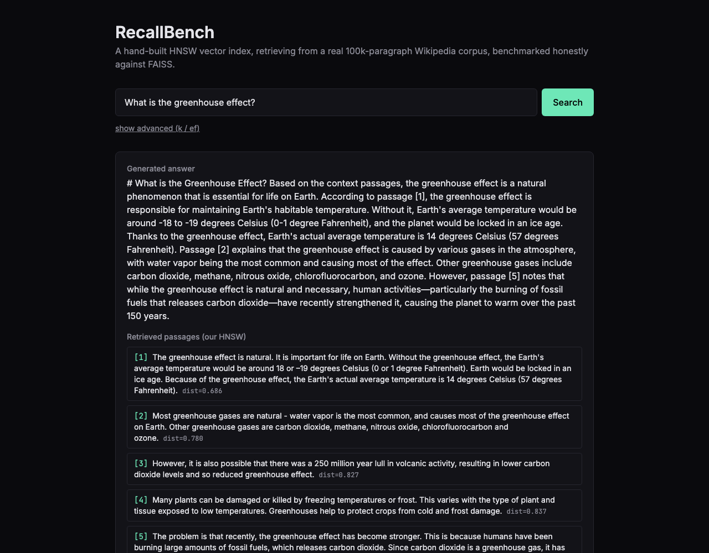
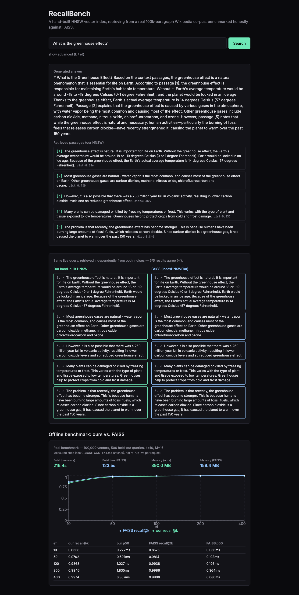
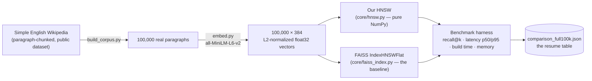
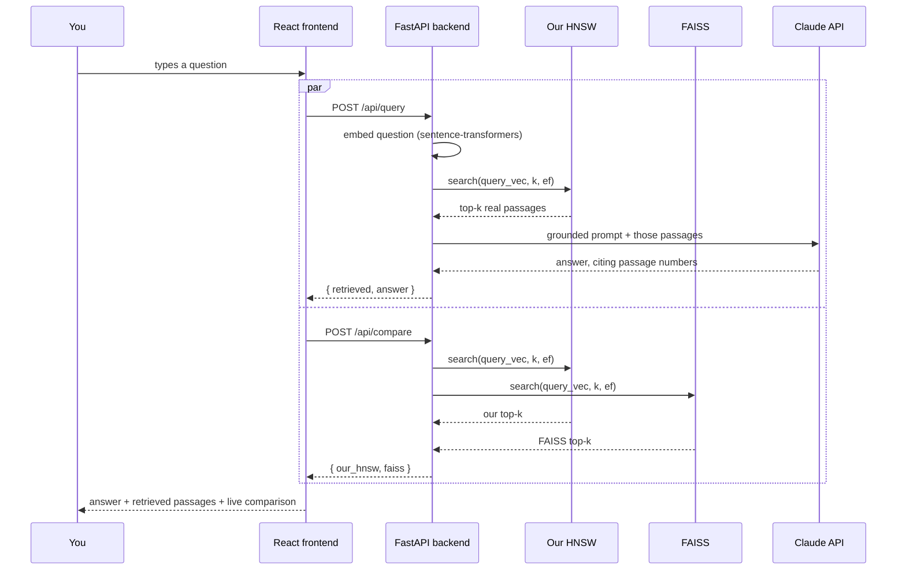
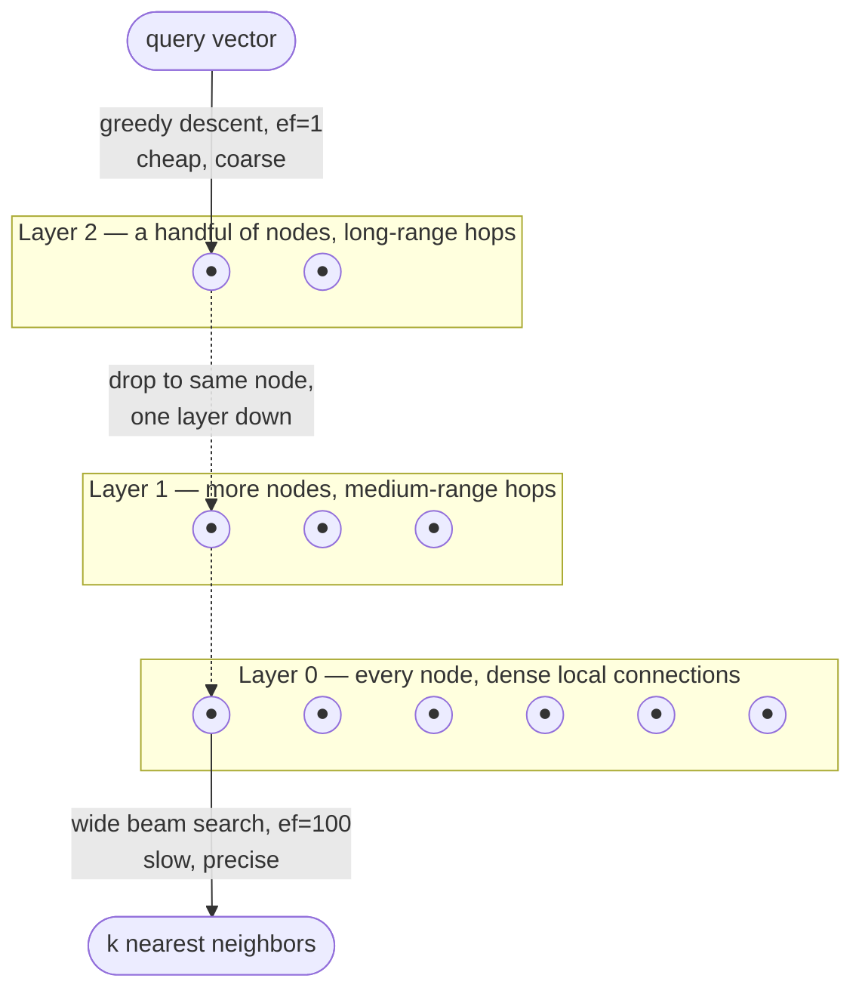

# RecallBench


A hand-built implementation of HNSW — the graph algorithm that powers real
vector databases like Pinecone and Weaviate — benchmarked honestly against
FAISS, the library everyone else just imports, then wrapped in a working
RAG pipeline so it retrieves from a real 100,000-paragraph Wikipedia corpus
instead of sitting in a notebook.

### Contents
[Why I built this](#why-i-built-this) · [How this was built](#how-this-was-built) · [Demo](#demo) · [Architecture](#architecture) · [How HNSW actually works](#how-hnsw-actually-works) · [The benchmark](#the-benchmark) · [Engineering log](#engineering-log) · [Limitations](#limitations--whats-next) · [Tech stack](#tech-stack) · [Running locally](#running-locally) · [API](#api)

---

## Why I built this

Anyone can say "I built a RAG app with LangChain and Pinecone." That
sentence describes wiring together two other people's libraries — it
doesn't prove you understand what's happening inside either of them.

Vector search is the part that actually matters in a RAG system: given a
question, find the handful of documents (out of possibly millions) that
are actually relevant, fast enough that a user doesn't notice the wait.
Every production vector database — Pinecone, Weaviate, Qdrant, FAISS
itself — solves this with some variant of the same idea: **HNSW**,
a layered graph that turns "check every single document" into "walk a
graph and land near the answer in a few dozen hops." I wanted to build
that graph myself, from the ground up, in plain NumPy, with no ANN
library anywhere near the core implementation — using one would have
defeated the entire point.

But a from-scratch implementation is worthless without a number attached
to it. "I built a vector search engine" survives about one follow-up
question in an interview; "I built one, benchmarked it against the
industry-standard library on the same 100k-document corpus, and can tell
you exactly where it wins, where it loses, and why" survives all of them.
So the second half of this project is just as deliberate as the first:
an honest, reproducible benchmark against FAISS — same data, same
queries, same measurement code for both sides — with every number in the
table below coming from a real run, never an estimate.

The third piece exists so the first two aren't just a benchmark script:
a working RAG demo, retrieval powered by my own HNSW (never FAISS — FAISS
is the yardstick here, not a component), with a live side-by-side view
showing exactly how my index's answer to a query compares to FAISS's, in
real time, on the same question.

## How this was built

Nine batches, each one a single focused unit of work — never multiple
unrelated things bundled together — built in this order, with a real
test against a real result required before the next one started:

| # | Batch | What it proved |
|---|---|---|
| 1 | HNSW graph construction | Layered graph builds correctly — reachability, degree caps, layer structure, all checked on a real 2000-node index |
| 2 | HNSW multi-layer search | The recall/latency tradeoff is real and controllable — recall climbs from 0.77 to 1.00 as `ef` increases, exactly as the algorithm predicts |
| 3 | Brute-force ground truth | An oracle independent of HNSW's own code exists to grade it against — can't share a bug with the thing it's judging |
| 4 | Corpus + embedding pipeline | Real Wikipedia text, real embeddings, verified row-order consistency between two separately-written output files |
| 5 | Benchmark harness | Reusable, index-agnostic measurement code — the same functions later graded FAISS with zero changes |
| 6 | FAISS integration | The actual comparison this project exists to produce — real numbers, on real data, at real scale |
| 7 | RAG pipeline | Retrieval + a grounded Claude answer, working end to end on real corpus text |
| 8 | FastAPI backend | The pipeline reachable over HTTP — query, live comparison, and benchmark endpoints |
| 9 | Frontend demo UI | All of the above, visible and usable in a browser, not just curlable |

Each batch's own reasoning — what was decided, what alternative got
rejected and why, what broke and how — is captured in the engineering
log below. The order above is also, not incidentally, the order in which
a real bug in one batch could only have been caught once the batch after
it existed to expose it (see: the memory-measurement story, or the
concurrency crash that only a real frontend could trigger).

## Demo

Type a question, get an answer grounded in real retrieved passages, plus
a live comparison against FAISS on the exact same query:



Scrolling further down the same page: the side-by-side compare view
(agreement between the two indices marked with ✓) and the real, measured
benchmark — a `recharts` chart of the recall/latency tradeoff plus the
full numeric table, computed once and served as-is, not re-run live on
every page load:



---

## Architecture

**Offline pipeline** — how a raw Wikipedia dump becomes two comparable,
queryable indices:



**Live serving path** — a question hitting the browser and coming back
as a grounded answer, plus a side-by-side comparison:



Both `/api/query` and `/api/compare` fire together, not because it's
convenient, but because they answer two genuinely different questions:
did the RAG pipeline produce a good answer, and does my index actually
agree with the industry-standard one on this exact query. (This
concurrency is also, not coincidentally, what surfaced the nastiest bug
in the whole project — see the engineering log.)

---

## How HNSW actually works

The core idea: searching every one of 100,000 vectors for the nearest
match is O(n) — accurate, but slow. HNSW instead builds a small-world
graph with multiple layers, each sparser than the one below it. The top
layer has only a handful of nodes and covers huge distances in the
vector space; the bottom layer contains every single node with dense,
local connections. A search starts at the top, greedily walks toward the
query through the sparse layers (cheap — `ef=1`, one hop at a time), then
switches to a wide beam search only once it reaches the dense bottom
layer, where the real precision work happens.



The `ef` parameter controls how wide that final beam search is — a
bigger beam explores more candidates, trading latency for recall. That
knob is the entire subject of the benchmark below: every row in the
results table is the same graph, searched at a different `ef`, showing
exactly how much accuracy costs how much time.

Two implementation decisions worth calling out because they're easy to
get wrong quietly:

- **Squared L2, not plain L2, and not cosine.** Square-rooting a distance
  is wasted work when all you need is a ranking — the order doesn't
  change. And since every embedding here is L2-normalized (a real,
  enforced invariant, not an assumption — see the corpus pipeline),
  squared-L2 ranking is mathematically identical to cosine ranking
  anyway, so there was never a reason to implement cosine separately.
- **Naive top-M neighbor selection, not the paper's diversity-aware
  heuristic.** The original HNSW paper's SELECT-NEIGHBORS-HEURISTIC
  avoids picking neighbors that are all clustered in one direction. I
  deliberately shipped the simpler version first and only planned to add
  the heuristic if the real recall benchmark showed naive selection
  losing meaningfully to FAISS. It didn't — recall stays within about a
  point of FAISS at every `ef` — so the heuristic never got added. That's
  not a shortcut; it's the benchmark doing its job and telling me where
  *not* to spend effort.

---

## The benchmark

Both indices, same 99,500-vector corpus (500 vectors held out as
queries), same `M=16`, same `ef_construction=200`, same seed. Every
number below is from one real, logged run — see the engineering log for
what it took to trust the memory numbers specifically.

| | Our HNSW | FAISS `IndexHNSWFlat` |
|---|---|---|
| Build time | 216.4s | 123.5s |
| Index memory | 390.0 MB | 159.4 MB |

| `ef` | our recall@10 | our p50 latency | FAISS recall@10 | FAISS p50 latency |
|---|---|---|---|---|
| 10  | 0.8338 | 0.222ms | 0.8576 | 0.036ms |
| 50  | 0.9702 | 0.607ms | 0.9814 | 0.108ms |
| 100 | 0.9868 | 1.027ms | 0.9938 | 0.196ms |
| 200 | 0.9946 | 1.835ms | 0.9986 | 0.364ms |
| 400 | 0.9974 | 3.307ms | 0.9998 | 0.686ms |

**Reading this honestly, not defensively:** FAISS wins on every metric —
it's a mature, production C++ library, and it would be a strange result
if a from-scratch Python implementation beat it. What matters is *how
much* and *why*. Raw vector storage costs about 152.9MB on both sides
(99,500 × 384 float32s, unavoidable either way). Subtract that out and
the real gap is stark: my graph's own bookkeeping costs **~237MB** in
Python dict/set overhead, versus FAISS's **~6.5MB** of packed C++ arrays
for the equivalent structure — a ~36x difference in overhead alone, and
the actual reason the memory and latency numbers look the way they do.
That's a specific, defensible answer to "why is yours slower," not a
shrug.

---

## Engineering log

Built in batches — one focused unit of work at a time, each one
explained, built, tested against a real result, and logged before the
next one started. These are the entries that involved a real decision or
a real bug, in the order they happened, not a changelog of every file
touched.

**A memory number that quietly lied — twice.** Batch 5's memory
measurement started as process RSS, and the first run reported 227.3MB.
Before moving on, I re-checked the measurement's own methodology and
found the baseline was taken *before* ground-truth computation finished
— so a ~146MB transient scratch allocation from an unrelated phase was
getting folded into "index memory." Moved the baseline, got 96.6MB,
moved on. Then FAISS joined the benchmark in Batch 6, and the same
RSS-based approach — even isolated into separate subprocesses
specifically to dodge cross-contamination — gave **three different
answers for the identical HNSW build**: 0MB, 95MB, 264MB, across three
back-to-back runs. RSS is a process-wide high-water mark; it reflects
whatever the allocator happened to do, not one data structure's real
size, and no amount of process isolation fixes that. Replaced it
entirely with `memory_bytes()` — a deterministic deep-walk of the
graph's actual owned Python objects on our side, `faiss.serialize_index()`'s
byte count on FAISS's — verified by asserting the number is bit-for-bit
identical across repeated calls on an unmodified index, the property RSS
could never have satisfied.

**An id-type bug that had already been fixed once, just not everywhere.**
Batch 3's `BruteForce` crashed on non-integer ids and got fixed with
`.item()`, converting any NumPy scalar back to its real Python type — the
fix even noted in its own commit that this would matter "once this is
exposed via an API." It was right: Batch 8's very first live API test
crashed immediately with a `numpy.int64 is not iterable` error from
FastAPI's JSON encoder, because `HNSW.search()` and `FaissHNSW.search()`
had never received the same fix — nothing had needed to serialize their
output before. Same one-line fix, propagated to both.

**A crash with no stack trace.** Building the frontend, the very first
real search — typing a question and clicking Search — hung the entire
server. Direct concurrent `curl` requests reproduced it: sometimes a
hang, sometimes the whole Python process **disappearing with no
traceback at all**, right after printing a progress bar's first line.
No traceback plus mid-native-call is the signature of a segfault, not a
Python exception. Root cause: the embedding model loads lazily on first
use with zero synchronization, and the frontend fires two endpoints at
once (`/api/query` and `/api/compare`, both genuinely needed) — both hit
the uninitialized model on separate threads simultaneously, and
concurrent first-time construction of a PyTorch model crashed the
process outright. A lock around construction alone wasn't enough —
concurrent *inference* calls could crash it too — so the fix serializes
the entire embedding call, construction and inference both, behind one
`threading.Lock()`. Verified by re-running the exact browser flow
afterward: zero console errors, a real answer, real retrieved passages.

**A race that only shows up under real concurrent load.** After the
backend shipped, an exhaustive review pass (eight parallel review agents,
every finding independently reproduced before being called a bug — see
below) flagged that `FaissHNSW.search()` sets FAISS's `efSearch` as a
side effect on shared index state, with no lock, right before a shared
FastAPI instance's threadpool could call it from two directions at once.
I verified the race directly with a minimal, unwrapped reproduction (raw
FAISS, no wrapper at all): two threads searching with different `ef`
values raced at roughly 1-in-800 — real, if narrow. Fixed with a lock
around the entire set-then-search critical section — the same bug class
as the embedding crash above, just one layer over. My first regression
test for this actually had its own bug (it compared FAISS's real string
ids against raw integer array positions, which can never match regardless
of any race) — caught and fixed before trusting the "verified" fix, which
is exactly the point of verifying instead of assuming.

**The same review pass also found:** `k<=0` crashing FAISS's C++ layer
outright while silently returning nearly-all results from our own HNSW
(Python's negative-slice semantics doing the wrong thing quietly);
zero input validation at the actual network boundary, so nothing stopped
a client from requesting `ef=5,000,000` and tying up a server thread;
and an unhandled `KeyError` risk if a persisted index and the corpus
metadata file were ever rebuilt out of sync. All three fixed at the
source — an early `k<=0` return in both index types, `Field(gt=0, le=...)`
bounds on the actual request schema, and a startup check that fails
loudly with an actionable message instead of a random per-request crash
weeks later.

**Say "I don't know" instead of guessing.** The RAG system prompt
explicitly tells Claude to answer only from the retrieved passages and
say so when they don't contain the answer — a design choice made so a
bad answer would always be traceable to bad retrieval, not the model
quietly filling gaps from its own training data. On the smaller test
corpus, asked a question its five retrieved passages genuinely didn't
answer directly, Claude did exactly that: said the context didn't
contain enough information rather than answering anyway. Nobody asked it
to hedge — the prompt asked it to be honest, and a real run showed that
instruction actually holding.

---

## Limitations & what's next

**No diversity-aware neighbor selection.** The HNSW paper's
SELECT-NEIGHBORS-HEURISTIC (avoiding neighbors clustered in one
direction) was deliberately skipped — the real recall benchmark never
showed naive top-M selection losing enough to FAISS to justify the extra
complexity. Worth revisiting only if a much larger corpus changes that.

**No index persistence versioning.** The live server loads
`data/hnsw_index.pkl` / `faiss_index.bin` built by a one-off script;
nothing tracks which corpus snapshot an index was built from beyond a
startup id-coverage check. A real production version would version the
corpus and index together explicitly, not just detect drift after the
fact.

**No auth, no rate limiting.** Every endpoint is open — fine for a local
demo, not for a public deployment. `k`/`ef` bounds stop the worst abuse
(an arbitrarily expensive single request) but nothing stops volume.

**Frontend renders answers as plain text, not Markdown.** Claude
occasionally opens an answer with a Markdown heading (`# ...`); the UI
shows it literally rather than rendering it. Cosmetic, not a data
problem — the retrieval and generation are both correct either way.

**Deployment is optional and, deliberately, not done.** The roadmap
always marked this "if going live" rather than required — the resume
payload (the benchmark table) and the working demo don't need a public
URL to be real. Reusing an existing AWS setup would keep marginal cost
near zero; a fresh EC2 instance would run real, ongoing money. Left as a
conscious choice, not an oversight.

---

## Tech stack

| Layer | Choice | Why |
|---|---|---|
| Core algorithm | Python 3.11, NumPy only | No ANN library anywhere near the HNSW implementation — using one would defeat the entire point of the project |
| Benchmark baseline | FAISS (`faiss-cpu`) | The industry-standard reference point this project measures itself against, never a shortcut inside the core implementation |
| Embeddings | `sentence-transformers`, `all-MiniLM-L6-v2` | Small, fast, free to run locally — no per-query embedding cost, 384-dim, L2-normalized output |
| LLM | Claude API (Haiku) | Grounded-only prompting; `AI_MOCK` flag skips real calls entirely so the whole pipeline runs with zero cost and no key |
| Backend | FastAPI | Async-capable, and its dependency-injection-free `app.state` pattern was simple enough for a single-process demo with no database |
| Frontend | React 19, TypeScript, Vite, Tailwind v4, Recharts | Typed API contract end-to-end; Recharts for the recall/latency chart |
| Corpus | Simple English Wikipedia (paragraph-chunked, public dataset) | Real, topically diverse text at a size (100k paragraphs) large enough for the benchmark numbers to mean something |

## Running locally

```bash
# Backend
python3.11 -m venv .venv && source .venv/bin/activate
pip install -r requirements.txt
cp .env.example .env               # AI_MOCK=true needs no API key at all

# Build the real corpus once (downloads + embeds 100k Wikipedia paragraphs)
python scripts/build_corpus.py

# Build and persist both indices once (~5-6 minutes; loads in seconds after)
python scripts/build_and_save_indices.py

# Run the real benchmark (optional — the committed results are already real)
python scripts/run_benchmark.py

# Serve the API
uvicorn app.main:create_app --factory --app-dir backend --port 8000

# Frontend, in a second terminal
cd frontend
npm install
cp .env.example .env
npm run dev
```

`AI_MOCK=true` (the default) skips real Claude calls entirely — the full
retrieval pipeline still runs, and the mock answer still reflects the
real retrieved passage ids, so nothing about testing retrieval requires
an API key.

## API

```
POST /api/query       Real RAG pipeline: embed -> our HNSW -> grounded Claude answer
POST /api/compare     Same live query against both our HNSW and FAISS, side by side
GET  /api/benchmark   The precomputed comparison_full100k.json, served as-is
GET  /health          Health check
```
