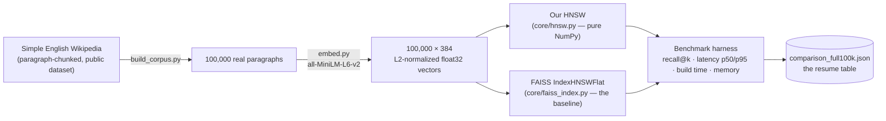
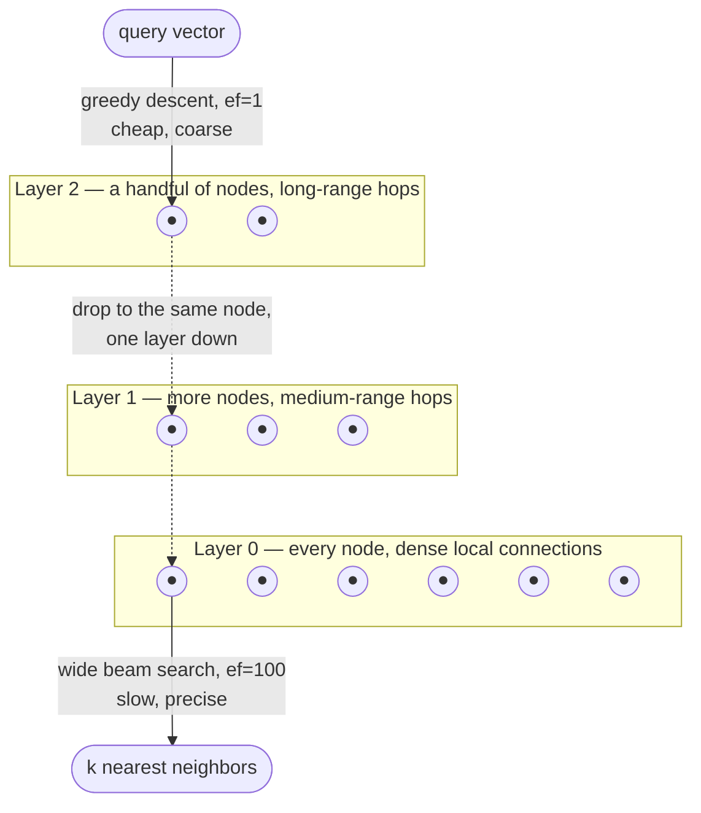

# RecallBench


A from-scratch implementation of HNSW — the graph algorithm underlying
production vector databases such as Pinecone and Weaviate — benchmarked
against FAISS, the industry-standard library, and built into a working
RAG pipeline that retrieves from a real 100,000-paragraph Wikipedia
corpus.

### Contents
[Why I built this](#why-i-built-this) · [How this was built](#how-this-was-built) · [Demo](#demo) · [Architecture](#architecture) · [How HNSW actually works](#how-hnsw-actually-works) · [The benchmark](#the-benchmark) · [Engineering log](#engineering-log) · [Limitations](#limitations--whats-next) · [Tech stack](#tech-stack) · [Running locally](#running-locally) · [API](#api)

---

## Why I built this

I use vector search the way most people building AI applications do —
through a library, behind an API call, without ever seeing what happens
between "here's a query" and "here are the ten most similar things in a
hundred thousand documents." That gap bothered me. I didn't want to just
know *that* HNSW makes this fast; I wanted to know *how*, well enough to
build it myself and watch it work.

So that's what this project is: HNSW, implemented from the ground up in
plain NumPy, with no shortcut library anywhere near the core. Not
because it needed reinventing — FAISS already does this better than I
was going to on a first attempt — but because building it was the only
way to actually understand the layered graph, the greedy descent, the
`ef` knob that trades speed for accuracy. Reading the paper told me what
the algorithm does. Implementing it is what taught me why every piece is
there.

Once it worked, the obvious next question was *how well*, and I didn't
want to guess. So the second half of this project holds the
implementation to an honest standard: a real benchmark against FAISS, on
the same data, the same queries, the same measurement code for both
sides. Every number in the table below is from a run I actually
executed, not an estimate — partly because that's the only way the
comparison means anything, and partly because I wanted to know the real
answer myself.

The last piece — a working RAG pipeline, retrieval powered entirely by
the index I built, with a live view comparing it to FAISS on the same
question — exists so the understanding didn't stay theoretical. It's one
thing to have a graph that passes its own tests; it's another to watch
it retrieve a real, relevant paragraph in response to a real question
and hand that off to an LLM for a grounded answer.

## How this was built

I didn't understand HNSW well enough at the start to build it in one
pass, so I didn't try to. I broke it into nine batches — one focused
piece of understanding at a time — and didn't let myself move to the
next one until the current one actually worked and I could explain why:

| # | Batch | What it taught me |
|---|---|---|
| 1 | HNSW graph construction | How the layered graph actually gets built — reachability, degree limits, and layer structure, checked against a real 2,000-node index rather than assumed |
| 2 | HNSW multi-layer search | That the recall/latency tradeoff isn't just theory — recall genuinely climbs from 0.77 to 1.00 as `ef` increases, exactly like the algorithm says it should |
| 3 | Brute-force ground truth | Why you need an answer key that shares no code with the thing being graded — otherwise a bug can hide from itself |
| 4 | Corpus + embedding pipeline | How much can quietly go wrong between two files that are supposed to describe the same data, and how to actually catch it |
| 5 | Benchmark harness | How to measure something in a way that's reusable — later, the exact same functions graded FAISS with no changes at all |
| 6 | FAISS integration | What "honest comparison" actually costs to get right — see the engineering log; this took more than one attempt |
| 7 | RAG pipeline | How to make retrieval and generation stay honest with each other, instead of an LLM quietly papering over bad retrieval |
| 8 | FastAPI backend | What "it works" stops meaning once real requests can hit it out of order, concurrently, with bad input |
| 9 | Frontend demo UI | That watching the thing run in a browser finds bugs that reading the code never will |

Every batch's reasoning — what I decided, what I tried and abandoned,
what broke and how I figured out why — is in the engineering log below.
The order matters: several of the real bugs I hit could only exist once
a later batch put enough pieces together to trigger them. I didn't find
the nastiest one until the frontend existed to reveal it.

## Demo

A question submitted to the query box returns an answer grounded in real
retrieved passages, alongside a live comparison against FAISS on the
identical query:


Further down the same page: the side-by-side comparison view (agreement
between the two indices marked with ✓) and the measured benchmark
results — a `recharts` chart of the recall/latency tradeoff plus the
full numeric table, computed once and served as-is rather than re-run on
every page load:


---

## Architecture

**Offline pipeline** — how a raw Wikipedia dump becomes two comparable,
queryable indices:



**Live serving path** — a query reaching the browser and returning as a
grounded answer, alongside a side-by-side comparison:


`/api/query` and `/api/compare` fire at the same time because they
answer two different questions I wanted answered together: did the
pipeline produce a good answer, and does my index actually agree with
the industry-standard one on this exact question. That decision — two
things happening at once — is also what eventually surfaced the hardest
bug I hit on this whole project. More on that below.

---

## How HNSW actually works

The part that made HNSW click for me wasn't the paper's pseudocode — it
was realizing what problem the layers are actually solving. Comparing a
query against every one of 100,000 vectors is accurate but slow, an
O(n) scan every single time. HNSW's answer is a small-world graph built
in layers, each one sparser than the layer below it. The top layer has
only a handful of nodes and can jump large distances across the vector
space in one hop; the bottom layer holds every node with dense, local
connections. A search starts at the top and greedily walks toward the
query through the sparse layers — cheap, `ef=1`, one hop at a time —
then switches to a much wider search only once it reaches the bottom,
where the real precision work happens.



`ef` is the width of that final beam search — wider means more
candidates explored, which means better recall at the cost of latency.
That single knob turned out to be the entire subject of the benchmark
below: every row in the results table is the same graph, searched at a
different `ef`, showing exactly what that trade actually costs.

Two decisions I made along the way, worth explaining because they're
easy to get wrong without realizing it:

- **Squared L2, not plain L2, and not cosine.** Square-rooting a
  distance is wasted work when only the ranking matters — the order
  doesn't change either way. And once I made sure every embedding here
  is genuinely L2-normalized (a real, enforced property, not something I
  assumed and hoped was true — see the corpus pipeline), squared-L2
  ranking became mathematically identical to cosine ranking. Implementing
  cosine separately would have been extra code for nothing.
- **Naive top-M neighbor selection, not the paper's diversity-aware
  heuristic.** The original paper's SELECT-NEIGHBORS-HEURISTIC avoids
  picking neighbors that all cluster in one direction. I shipped the
  simpler version first on purpose, and told myself I'd only add the
  real heuristic if the recall benchmark showed the naive version
  losing meaningfully to FAISS. It didn't — recall stays within about a
  point of FAISS at every `ef` — so I never added it. That wasn't
  laziness; it was the benchmark answering a question I couldn't have
  answered by just reading the paper.

---

## The benchmark

Both indices, the same 99,500-vector corpus (500 vectors held out as
queries), the same `M=16`, the same `ef_construction=200`, the same
seed. Every number below is from one real, logged run — see the
engineering log for what it actually took to trust the memory figures.

| | Our HNSW | FAISS `IndexHNSWFlat` |
|---|---|---|
| Build time | 216.4s | 123.5s |
| Index memory | 390.0 MB | 159.4 MB |

| `ef` | our recall@10 | our p50 latency | FAISS recall@10 | FAISS p50 latency |
|---|---|---|---|---|
| 10  | 0.8338 | 0.222ms | 0.8576 | 0.036ms |
| 50  | 0.9702 | 0.607ms | 0.9814 | 0.108ms |
| 100 | 0.9868 | 1.027ms | 0.9938 | 0.196ms |
| 200 | 0.9946 | 1.835ms | 0.9986 | 0.364ms |
| 400 | 0.9974 | 3.307ms | 0.9998 | 0.686ms |

I'll read this straight rather than spin it: FAISS wins on every single
metric. It's a mature, production C++ library maintained by people who
do this full-time — it would honestly have been a strange result if my
first attempt beat it. What I actually cared about was understanding
*why*, not closing the gap. Raw vector storage costs about 152.9MB on
both sides (99,500 × 384 float32 values — unavoidable either way).
Subtract that out and the real difference is stark: my own graph's
bookkeeping costs roughly **237MB** in Python dict and set overhead,
against FAISS's roughly **6.5MB** of packed C++ arrays doing the same
job — about a 36x difference in overhead alone, and the actual reason
the memory and latency numbers look the way they do. That answer — a
specific, traceable one — is what I was actually after.

---

## Engineering log

Built in batches, one piece of understanding at a time, each one
explained before it was built, tested against something real, and
logged before I let myself move on. These are the entries where I
actually got something wrong, or hit something I didn't expect — not a
changelog of every file I touched.

**A memory number that fooled me twice, in two different ways.** My
first attempt at measuring memory used process RSS, and it reported
227.3MB. Before trusting that number, I went back over the measurement
itself and found the baseline had been taken *before* an unrelated
computation finished — a roughly 146MB scratch allocation from
somewhere else was quietly getting counted as if it were the index's
own memory. Moving the baseline fixed it to 96.6MB, and I thought that
was the end of it. It wasn't. Once FAISS joined the benchmark, the same
RSS-based approach — even after I isolated each build into its own
subprocess specifically to stop this kind of contamination — gave me
**three different answers for the exact same HNSW build**: 0MB, 95MB,
264MB, three runs in a row. That's when I understood the real problem:
RSS is a process-wide high-water mark, not a measurement of one data
structure, and no amount of isolating processes fixes that if the thing
you're measuring was never the right thing to measure. I replaced it
entirely with `memory_bytes()` — a direct, deterministic walk of the
graph's actual owned Python objects on my side, and FAISS's own
`serialize_index()` byte count on the other — and only trusted it once I
confirmed it gave the identical number, bit for bit, every single time I
called it on an unchanged index. RSS had never once managed that.

**A bug I'd already fixed once, without realizing where else it lived.**
Early on, my brute-force ground-truth code crashed on non-integer ids,
and I fixed it with `.item()` — converting whatever NumPy scalar type
came back into a real Python type. At the time I even wrote a note to
myself that this would matter once anything needed to turn these results
into JSON. I was right, and I'd still managed to forget it: the first
time I actually hit the backend with a real request, it crashed
instantly with `numpy.int64 is not iterable`, because I'd never gone
back and applied the same fix to my own HNSW or the FAISS wrapper —
nothing had needed it until an API existed. Same one-line fix, just
finally in all three places instead of one.

**A crash with no stack trace, which scared me for a minute.** The
first time I actually used the frontend — typed a question, clicked
search — the whole server just hung. No error, nothing in the logs.
Sending the same requests by hand from the terminal reproduced it: some
of the time a hang, and some of the time the entire Python process
**disappeared with no traceback at all**, right after printing the
first line of a progress bar. No traceback plus dying inside a native
call is what a segfault looks like, not what a normal Python bug looks
like. Digging in, the actual cause was almost mundane: my embedding
model loads itself the first time it's used, with no protection against
two things asking for it at once — and the frontend calls two endpoints
at the same moment on purpose (`/api/query` and `/api/compare`, both
genuinely needed for the page). Both hit the not-yet-loaded model on two
different threads at the same instant, and building the model twice at
once from two threads crashed the whole process. Locking just the setup
step wasn't enough, either — it turned out even running the model
*after* it's loaded isn't safe to do from two threads simultaneously —
so the fix locks the entire embedding call, start to finish, behind one
lock. I only trusted it once I ran the exact same browser flow again and
watched it come back clean: no console errors, a real answer, real
passages.

**A race I only found because I went back and checked things I'd
already shipped.** After the backend was working, I went back through
everything more carefully than I had the first time — not because
something was obviously broken, but because I wanted to be sure. That's
how I found that my FAISS wrapper sets FAISS's search width (`efSearch`)
as a side effect on a single shared object, with no lock, right before
the backend could call it from two directions at once. I built the
smallest possible reproduction I could — raw FAISS, no wrapper at all —
and confirmed it: two threads searching with different search widths
really did race, about once in every eight hundred tries. Rare, but
real. I fixed it the same way as the crash above, with a lock around the
whole set-and-search step. The first test I wrote to prove the fix
worked was itself wrong — I'd compared FAISS's real string ids against
plain number positions, which could never match regardless of any race
— and catching that in myself, before believing my own "it's fixed,"
mattered as much as the actual fix.

**Going back over everything also turned up:** a search for zero results
that crashed FAISS outright while my own HNSW just quietly returned
almost everything instead of erroring (Python's negative-slicing doing
something technically correct and completely wrong); no limits anywhere
on what a request could actually ask for, so nothing stopped a search
width of five million from tying up a server thread; and a case where,
if the saved index and the text it's supposed to point to ever fell out
of sync, the very first affected query would just crash with no useful
explanation. I fixed all three at the root — an early, explicit "return
nothing" for a zero-or-negative request in both index types, real
bounds on what a request is even allowed to ask for, and a check at
startup that fails loudly and clearly instead of waiting to fail
randomly later.

**Getting Claude to say "I don't know" instead of guessing.** I told
Claude, explicitly, to answer only from the passages it was actually
given, and to say so plainly if those passages didn't contain the
answer — I wanted a bad answer to always trace back to bad retrieval,
never to the model quietly filling in gaps from what it already knew.
On a smaller test corpus, I asked a question its five retrieved
passages genuinely didn't answer, and Claude did exactly what I'd asked:
said the context wasn't enough, instead of answering anyway. I hadn't
built anything special to make that happen — I'd just asked for honesty
and watched a real run actually deliver it.

---

## Limitations & what's next

**No diversity-aware neighbor selection.** The original paper's
SELECT-NEIGHBORS-HEURISTIC, which avoids picking neighbors that cluster
in one direction, was left out on purpose — the real recall benchmark
never showed the simpler version losing enough to FAISS to justify
building the more complex one. Worth coming back to only if a much
larger corpus changes that answer.

**No versioning on the saved indices.** The live server loads
`data/hnsw_index.pkl` and `faiss_index.bin`, built once by a script;
nothing tracks which exact corpus snapshot either one came from beyond a
check at startup that the two at least agree with each other. A real
version of this would version the corpus and the index together
explicitly, instead of only catching drift after it's already happened.

**No authentication, no rate limiting.** Every endpoint is open, which
is fine for something running on my own machine and not fine for
anything public. The bounds on `k`/`ef` stop the worst single request;
nothing stops volume.

**The frontend shows answers as plain text, not rendered Markdown.**
Claude sometimes opens an answer with a Markdown heading, and the
interface just shows the raw `#` instead of rendering it. Cosmetic, not
a correctness problem — the retrieval and the answer underneath are
both fine.

**Deployment is optional, and I left it that way on purpose.** It was
always marked "if going live" in the plan, not required — the benchmark
table and the working demo don't need a public URL to be real. Reusing
infrastructure I already have would cost almost nothing extra; standing
up something new would cost real, ongoing money for a step that was
never actually required. A deliberate choice, not something I ran out of
time for.

---

## Tech stack

| Layer | Choice | Why |
|---|---|---|
| Core algorithm | Python 3.11, NumPy only | No approximate-nearest-neighbor library anywhere near the HNSW implementation — using one would have skipped the entire reason I built this |
| Benchmark baseline | FAISS (`faiss-cpu`) | The real, industry-standard thing to measure myself against — never used as a shortcut inside the core implementation |
| Embeddings | `sentence-transformers`, `all-MiniLM-L6-v2` | Small and fast enough to run locally with no per-query cost; 384-dimensional, L2-normalized output |
| LLM | Claude API (Haiku) | Grounded-only prompting; the `AI_MOCK` flag skips real calls entirely, so the whole pipeline runs at zero cost and without a key |
| Backend | FastAPI | Async-capable, and its `app.state` pattern was simple enough for a single-process demo with no database |
| Frontend | React 19, TypeScript, Vite, Tailwind v4, Recharts | A typed API contract end-to-end; Recharts for the recall/latency chart |
| Corpus | Simple English Wikipedia (paragraph-chunked, public dataset) | Real, topically diverse text at a scale (100,000 paragraphs) large enough for the benchmark numbers to actually mean something |

## Running locally

```bash
# Backend
python3.11 -m venv .venv && source .venv/bin/activate
pip install -r requirements.txt
cp .env.example .env               # AI_MOCK=true requires no API key

# Build the real corpus once (downloads and embeds 100k Wikipedia paragraphs)
python scripts/build_corpus.py

# Build and persist both indices once (~5-6 minutes; loads in seconds afterward)
python scripts/build_and_save_indices.py

# Run the real benchmark (optional — the committed results are already real)
python scripts/run_benchmark.py

# Serve the API
uvicorn app.main:create_app --factory --app-dir backend --port 8000

# Frontend, in a second terminal
cd frontend
npm install
cp .env.example .env
npm run dev
```

`AI_MOCK=true` (the default) skips real Claude calls entirely — the full
retrieval pipeline still runs, and the mock answer still reflects the
real retrieved passage ids, so no part of testing retrieval requires an
API key.

## API

```
POST /api/query       Real RAG pipeline: embed -> our HNSW -> grounded Claude answer
POST /api/compare     Same live query against both our HNSW and FAISS, side by side
GET  /api/benchmark   The precomputed comparison_full100k.json, served as-is
GET  /health          Health check
```
